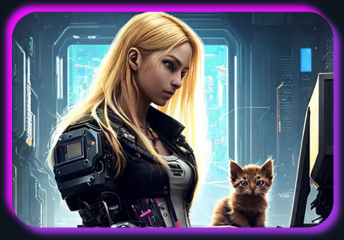

## Hola soy Raquel 👋😼

  <h3>Junior Developer</h3>

 - 🌱 Aprendiendo cosas nuevas.
 
 - 🔭 Buscando un trabajo para poder dar todo de mi.

 - 💬 Contacta conmigo  &nbsp;&nbsp; 
   
 
 

   <a href="https://raquelcasaresdelapoza-miportfolio.netlify.app" target="blank">
  <h4>👉🏼 <b><u>Mi Portfilio</u></b> ¡Échale un vistazo! 😄</h4></a>
   

<!--
**Quake006/Quake006** is a ✨ _special_ ✨ repository because its `README.md` (this file) appears on your GitHub profile.

Here are some ideas to get you started:

- 🔭 I’m currently working on ...
- 🌱 I’m currently learning ...
- 👯 I’m looking to collaborate on ...
- 🤔 I’m looking for help with ...
- 💬 Ask me about ...
- 📫 How to reach me: ...
- 😄 Pronouns: ...
- ⚡ Fun fact: ...

-->
