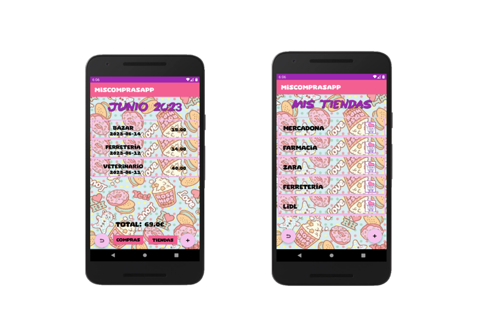
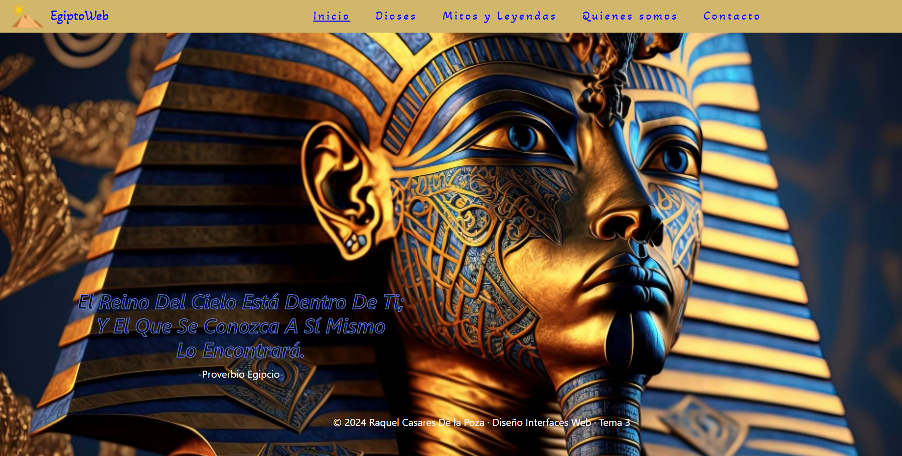

## Hi there 👋

<!--
**Quake006/Quake006** is a ✨ _special_ ✨ repository because its `README.md` (this file) appears on your GitHub profile.

Here are some ideas to get you started:

- 🔭 I’m currently working on ...
- 🌱 I’m currently learning ...
- 👯 I’m looking to collaborate on ...
- 🤔 I’m looking for help with ...
- 💬 Ask me about ...
- 📫 How to reach me: ...
- 😄 Pronouns: ...
- ⚡ Fun fact: ...
-->
<!--START_SECTION:proyectos-->
<table>
  <tr>
    <td align="center">
      
       
      <a href="MiPortfolio/img/proyectos/miPeluditoSOS.png">Web Caninoterapia / MiPeluditoSOS</a>
    </td>
    <td align="center">
      
       
      <a href="MiPortfolio/pdf/Proyecto Integrado-Raquel Casares De la Poza.pdf">App Android / MisComprasApp</a>
    </td>
    <td align="center">
      
       
      <a href="https://66769bc1ff107b66af3e5048--statuesque-starlight-321dab.netlify.app/">EgiptoWeb</a>
    </td>
  </tr>
